# What the Flexbox?!


## Creating a Flex container

Given:

```html
<div class="container">
  <div class="box box1">1</div>
  <div class="box box2">2</div>
  <div class="box box3">3</div>
  <div class="box box4">4</div>
  <div class="box box5">5</div>
  <div class="box box6">6</div>
  <div class="box box7">7</div>
  <div class="box box8">8</div>
  <div class="box box9">9</div>
  <div class="box box10">10</div>
</div>
```

By default, when the parent container is set to `display: flex`, each child gets turned into a flex item.

We've got two axis: the main axis and the cross axis.

## flex-direction: row

```
flex-direction: row;
main axis --> X from LEFT to RIGHT
cross axis --> Y from TOP to BOTTOM

items on the horizontal (main) axis are laid out from left to right
```

When `flex-direction: row`, each flex item has its width determined by its own content (i.e. each flex item will be as wide as its content is). The height of each child, however, matches that of the container (each child stretches as high as the container). This is b/c by default `align-items: stretch` within `.container`.

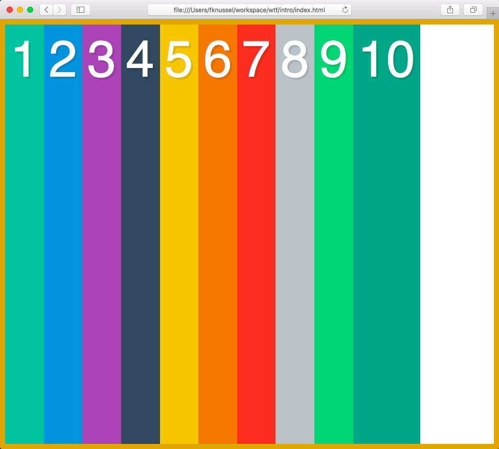

The above layout corresponds to the following styles:

```css
.container {
  display:flex;
  border: 10px solid goldenrod;
  height: 100vh;
}
```

When removing the fixed height, the container is as tall as its content (like a regular div):

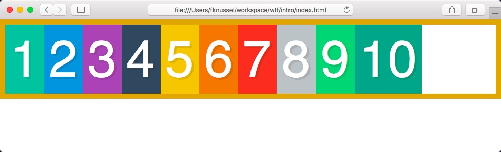

## flex-direction: column

```
flex-direction: column;
main axis --> Y from TOP to BOTTOM
cross axis --> X from LEFT to RIGHT
```

When `flex-direction: column`, each flex item has its height determined by its content whereas it will be as wide as the container element is. In this case, our `container` element will behave like a block element does.

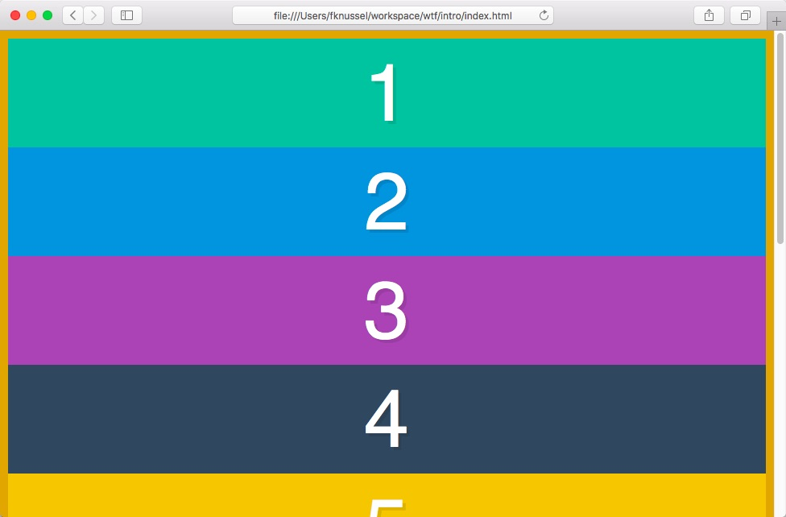

```css
.container {
  border: 10px solid goldenrod;
  display: flex;
  flex-direction: column;
}
```

## Reversing the direction of the main axis

And yes, the direction is important b/c you can then reverse it:

```
flex-direction: row-reverse;
main axis --> X from RIGHT to LEFT
```

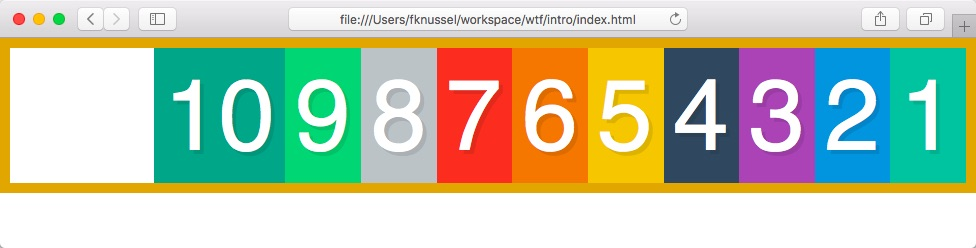

```
flex-direction: column-reverse;
main axis --> Y from BOTTOM to TOP
```

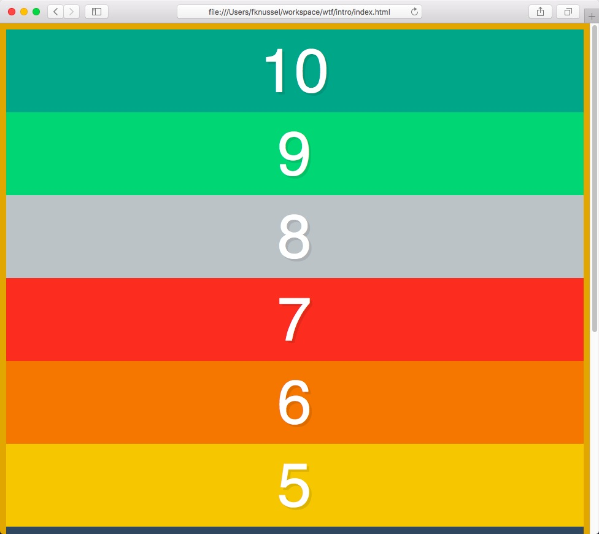

## Setting the width of the flex items (children of container)

```css
.container {
  border: 10px solid goldenrod;
  display: flex;
}

.box {
  width: 300px;
}
```

The nature of flexbox is that it's gonna try to work with the widths that you give it, but if it just doesn't work out it's gonna evenly distribute the available space.

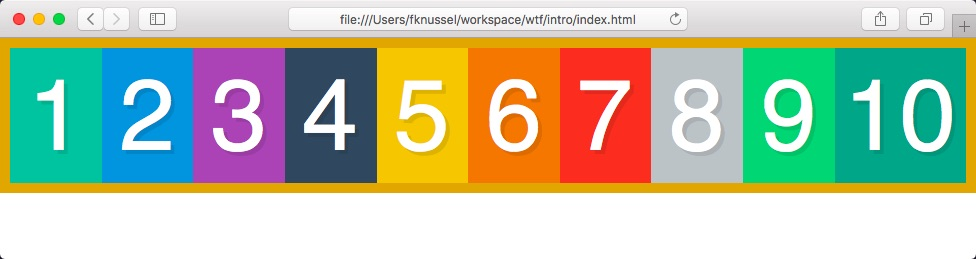

^ Clearly the width of the screen is not 3000px (300px * 10 elements).

## Wrap

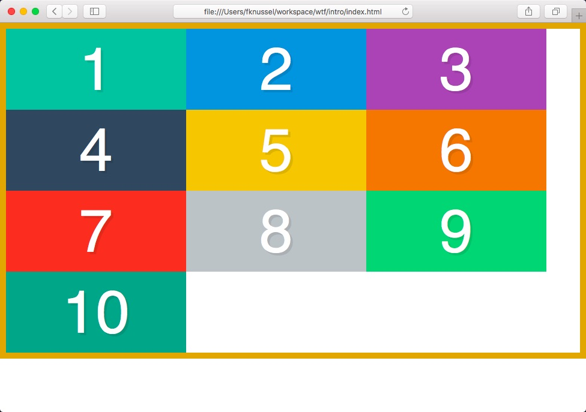

```css
.container {
  border: 10px solid goldenrod;
  display: flex;
  flex-wrap: wrap; /* <-- */
}

.box {
  width: 300px;
}
```

If we now set the container to `100vh` the remaining vertical space gets evenly distributed among the children (flex items). We are not giving each child a fixed height, it's being set automatically based on the container height.

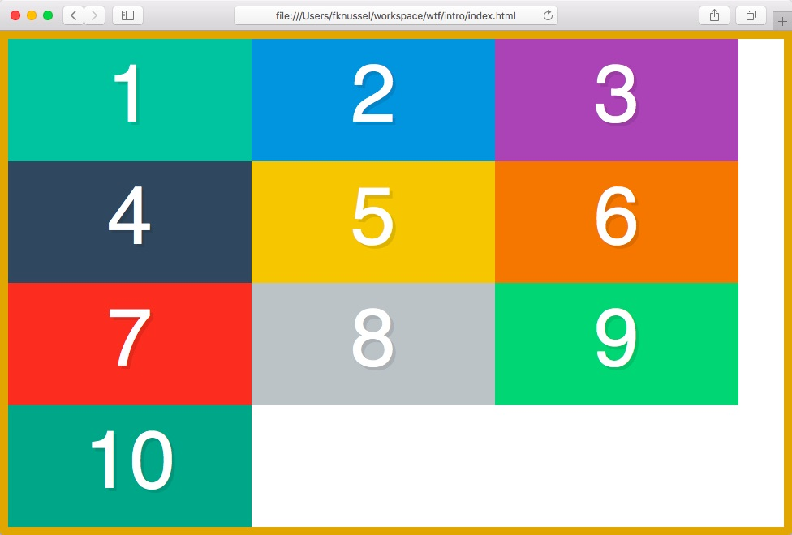

```css
.container {
  border: 10px solid goldenrod;
  display: flex;
  flex-wrap: wrap;
  height: 100vh; /* <-- */
}

.box {
  width: 300px;
}
```

## Reversing the cross axis

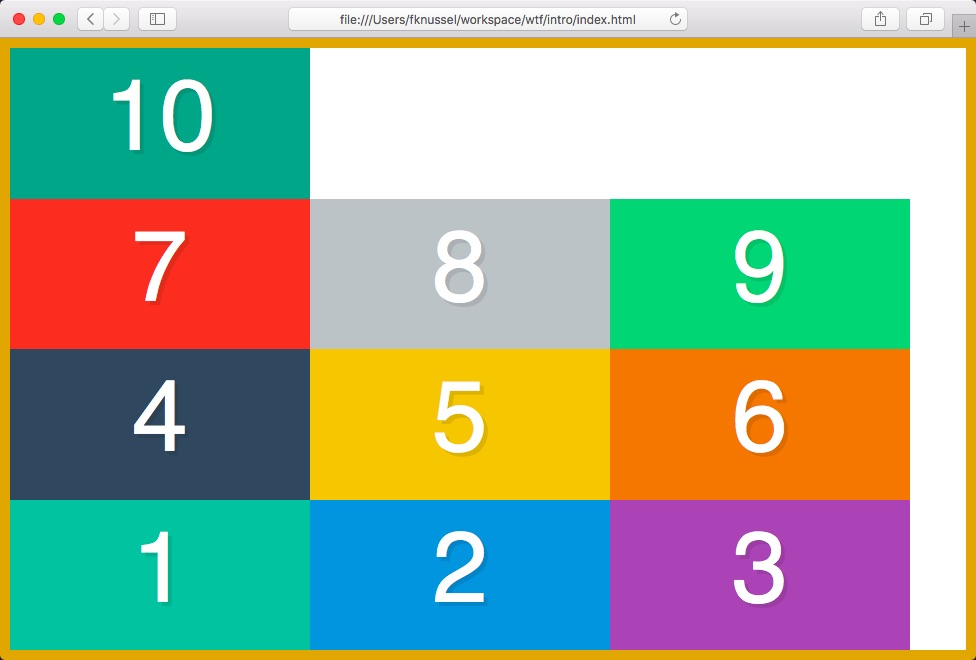

```css
.container {
  border: 10px solid goldenrod;
  display: flex;
  flex-wrap: wrap-reverse; /* <-- */
  height: 100vh;
}

.box {
  width: 300px;
}
```

For a `flex-direction: row`, setting `flex-wrap: wrap-reverse` makes the cross axis go from bottom to top (instead of laying out flex items from top to bottom).

My items are still starting at the left hand side, from left to right (b/c of `flex-direction: row`) but they start at the bottom and work their way up.

## The `flex` property

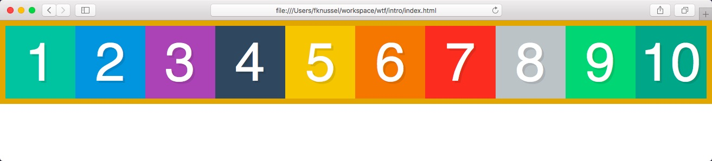

The value `1` on `flex: 1` measures at what proportion should i scale up or down when we've got either extra space or not enough space.

If all children are set to `flex: 1` the **extra space** will be evenly distributed among the flex items (children).


If there's one of those children set to `flex: 2` that means that particular child will take up twice as much **of the extra space** as its `flex: 1` counterparts.

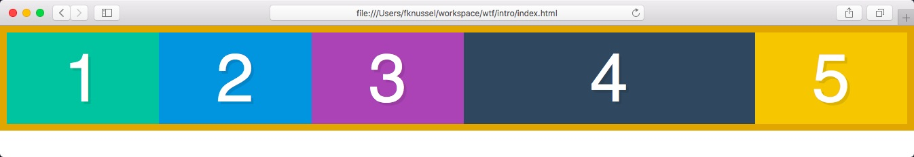

Or even half as much when `flex: 0.5`:

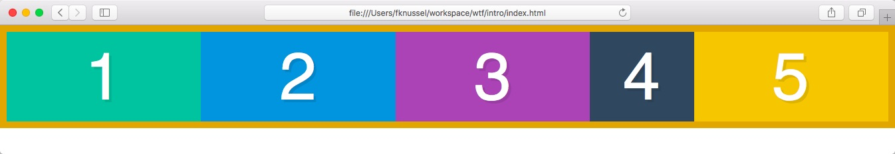

Note that this property is set on the children, not on the container.

## `flex: 1` is a shortcut

```css
flex-grow: 1
```

When we have extra space, how should we divide it amongst everybody on the same line?

The higher the value, the wider the element gets.

The default is `0`, meaning when there's extra room, don't do anything.

```css
flex-shrink: 1
```

When we have not enough space, how much of myself should I give up in proportion to the other elements on the same line?

e.g. if `flex-shrink: 2` for a particular child, then that element is gonna shrink twice as much as its siblings when there's no enough room.

The higher the value, the narrower the element gets.

The default is `1` meaning when there's no enough room, just evenly resize the children to make them fit

```
flex-basis: auto
```

How big should our element be before we start growing or shrinking?

## Changing the order of the flex items

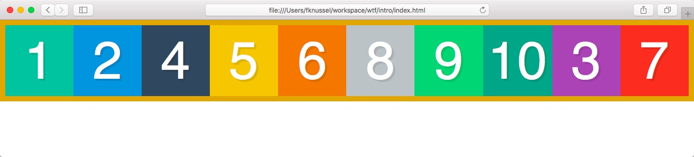

By default all items are set to `order: 0` meaning that if you give any item an `order: 1` will be place after all of the default ordered items.

The `order` property also takes negative integer values.

## Alignment

* Along the main axis with `justify-content`
* Along the cross axis with `align-items` (the container must have some sort of height defined)
* Split the extra space on the cross axis with `align-content` (the container must be wrapping items)

Particularly interesting use case: `align-items: baseline`

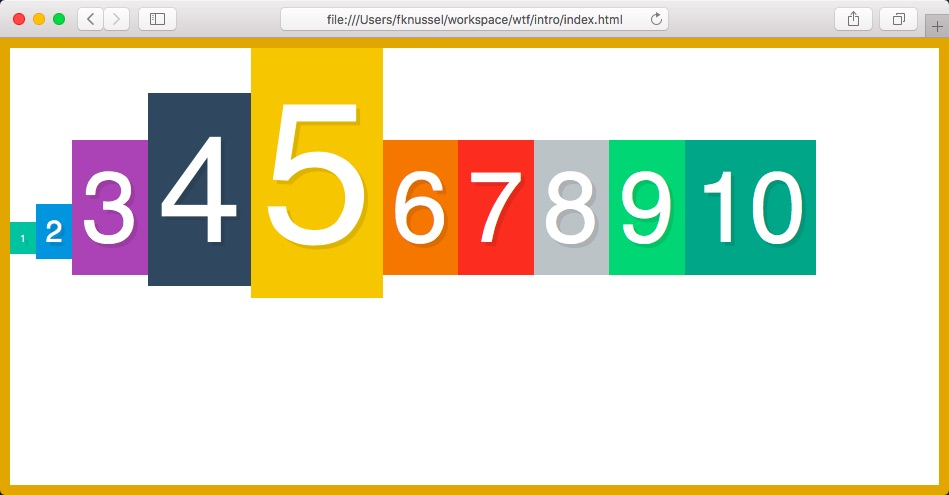

## `align-items: center` vs `align-content: center`

`align-items: center` handles the cross position of the flex items:

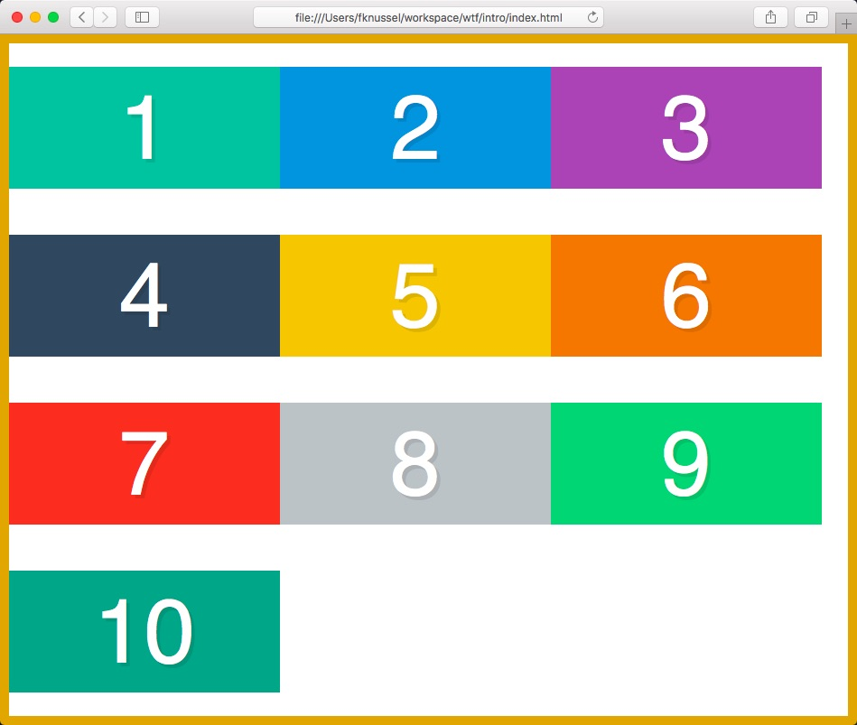

`align-content: center` handles the extra space, not the items:

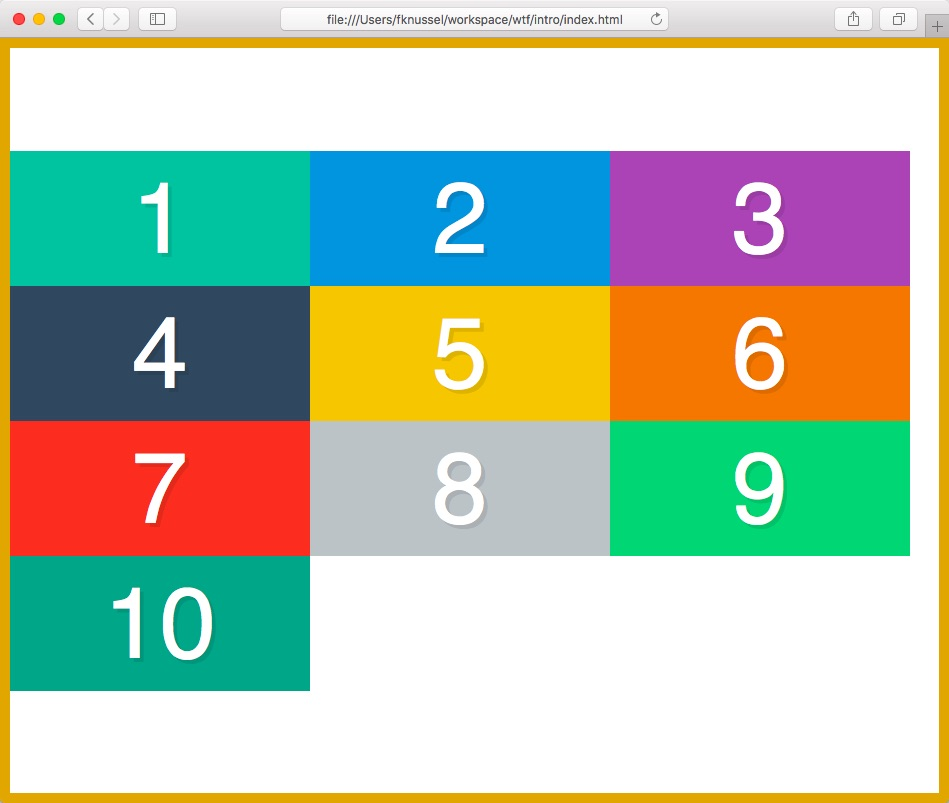

## align-self

The align-self property overrides the flexible container's align-items property.

## Defaults:

```css
/* Container */
flex-direction: row
flex-wrap: nowrap;
justify-content: flex-start;
align-items: stretch;
align-content: stretch;

/* Children */
order: 0;
align-self: auto;
flex-grow: 0;
flex-shrink: 1;
flex-basis: auto;
```
